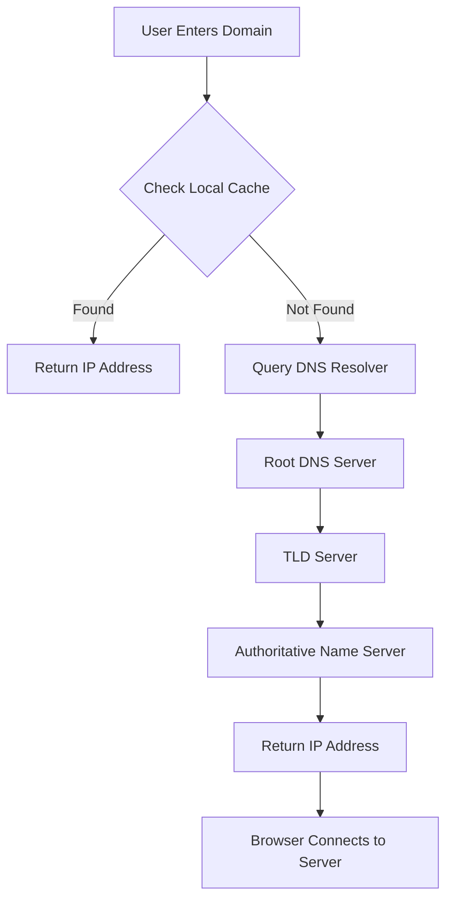

<br />

## How DNS Works

Imagine you want to visit a website like `www.example.com`. You type this friendly domain name into your browser, but your computer doesn't understand words—it speaks the language of numbers, specifically IP addresses.

So how does your computer find the website's IP address? Enter **DNS (Domain Name System)**, the internet’s translator.

***

## DNS Resolution Process (Simplified)

1. You enter a domain name (`www.example.com`) into your browser
2. Your system checks if the IP is already cached locally
3. If not, it queries a DNS resolver
4. The resolver contacts root, TLD, and authoritative name servers
5. The correct IP address is returned
6. Your browser connects to the server using that IP

***

## Flowchart



<br />

## Key DNS Concepts

In the **Domain Name System (DNS)**, a **zone** is a distinct portion of the domain namespace managed by a specific entity or administrator. Think of it as a virtual container for a group of domain names.

For example, `example.com` and its subdomains (like `mail.example.com` or `blog.example.com`) typically belong to the same DNS zone.

***

## Zone File

A **zone file** is a text file stored on a DNS server that defines the **resource records** for a domain. These records provide the information needed to translate domain names into IP addresses.

### Example Zone File (`example.com`)

```dns
$TTL 3600 ; Default Time-To-Live (1 hour)
@       IN SOA   ns1.example.com. admin.example.com. (
                2024060401 ; Serial number (YYYYMMDDNN)
                3600       ; Refresh interval
                900        ; Retry interval
                604800     ; Expire time
                86400 )    ; Minimum TTL

@       IN NS    ns1.example.com.
@       IN NS    ns2.example.com.
@       IN MX 10 mail.example.com.
www     IN A     192.0.2.1
mail    IN A     198.51.100.1
ftp     IN CNAME www.example.com.
```
